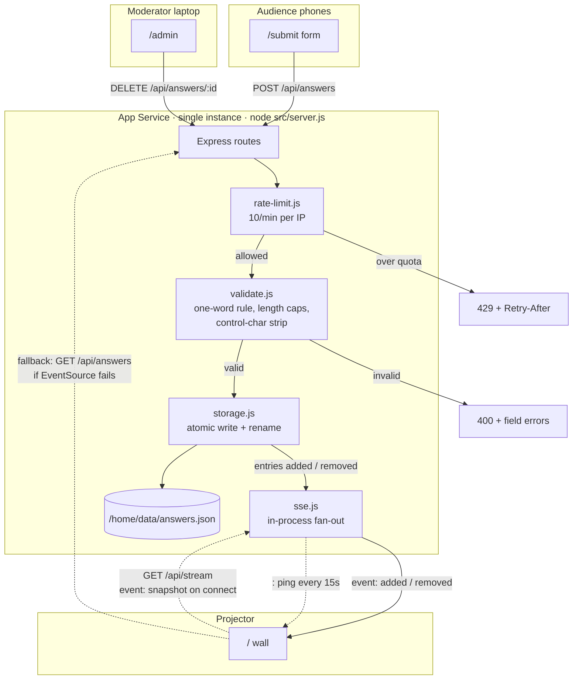

# Sovereignty Wall — handover

**Status: deployed, verified end to end, ready for the session.**

| | |
| --- | --- |
| Repo | https://github.com/warrendt/sovereignty-wall (private) |
| Wall (projector) | https://sovereignty-wall-7y580s.azurewebsites.net/ |
| Submit (audience) | https://sovereignty-wall-7y580s.azurewebsites.net/submit |
| QR (full screen) | https://sovereignty-wall-7y580s.azurewebsites.net/qr |
| Admin (moderation) | https://sovereignty-wall-7y580s.azurewebsites.net/admin?key=`<ADMIN_KEY>` |
| Resource group | `rg-sovereignty-wall` (westeurope) |
| App Service | `sovereignty-wall-7y580s`, Linux, B1, 1 instance |

Retrieve the admin key (it is deliberately not in the repo):

```bash
az webapp config appsettings list \
  -g rg-sovereignty-wall -n sovereignty-wall-7y580s \
  --query "[?name=='ADMIN_KEY'].value" -o tsv
```

---

## Run sheet for the session

1. **Before the room fills** — open the wall on the projector:
   `https://sovereignty-wall-7y580s.azurewebsites.net/`
   Check the top-right indicator says **Live** (green). That means SSE is connected.
2. **To get people submitting** — switch the projector to
   `https://sovereignty-wall-7y580s.azurewebsites.net/qr` for a full-screen QR.
   Leave it up for a minute, then switch back to the wall.
3. **Latecomers** are covered: the wall keeps a QR and the short URL in the
   bottom-right corner permanently.
4. **If something inappropriate appears** — open the admin URL on your laptop or
   phone (keep that tab open *before* you start) and hit Delete. It disappears
   from the projector within a second, no refresh needed.
5. **Clearing the wall** — one command wipes every answer:
   ```bash
   node scripts/clear.mjs https://sovereignty-wall-7y580s.azurewebsites.net "$ADMIN_KEY"
   ```
   Connected projectors update live, no refresh. Note that `az webapp restart`
   does *not* clear it — data persists in `/home/data` by design.

### Pre-flight check (30 seconds)

```bash
node scripts/verify.mjs https://sovereignty-wall-7y580s.azurewebsites.net "$ADMIN_KEY"
```

This creates a test answer, proves it arrives over the live SSE stream, then
deletes it again. It should print `20/20 checks passed`.

Run `clear.mjs` immediately afterwards — the URL is already discoverable and
early arrivals do submit before the session starts.

---

## What was built

Three audience-facing surfaces plus a moderation escape hatch, on Node 22 +
Express 5 with **no build step** and **two pure-JS dependencies** (`express`,
`qrcode`).

| Route | Purpose |
| --- | --- |
| `GET /` | The projector wall. Two labelled zones, scattered answers, live. |
| `GET /submit` | The audience form. Two fields, thank-you state, "submit another". |
| `GET /qr` | Full-screen scannable QR pointing at `/submit`. |
| `GET /qr.svg` | The QR itself, as SVG, generated from the incoming request host. |
| `GET /admin?key=…` | Moderation list with per-answer delete. |
| `GET /api/answers` | JSON snapshot. |
| `POST /api/answers` | Submit. JSON or form-encoded. |
| `DELETE /api/answers/:id` | Moderation delete. Requires the admin key. |
| `GET /api/stream` | The SSE stream. |
| `GET /healthz` | `{ok, answers, streams}`. |

### Request and SSE flow



The wall subscribes to `/api/stream`. On connect the server immediately sends a
`snapshot` event, which removes the race between "fetch the current answers" and
"subscribe to new ones" — there is only one code path, and it cannot miss an
answer that lands mid-handshake.

---

## Decisions worth knowing

### Data is stored per answer, not per submission

One submission produces one or two entries (`{id, question, text, createdAt,
submissionId}`). This means a moderator can delete a single offending word
without destroying the person's perfectly good answer to the other question, and
each wall zone gets a flat list to render.

### Question 1 rejects, question 2 truncates

The brief capped q1 at ~30 chars and q2 at ~120, but didn't say what to do on
overflow. These are different situations:

- **q1 (one word) over 30 chars → rejected.** Truncating a single word puts a
  mangled fragment on a projector. Better to let the person fix it.
- **q2 (a phrase) over 120 chars → truncated** to 120 code points with an ellipsis.
  Rejecting a long sentence is annoying; trimming it is understood.

Lengths are counted in **code points**, not UTF-16 units, so slicing can't split
an emoji in half.

### The invisible-character strip deliberately spares `\t \n \r`

Stripping a newline would turn `"one\ntwo"` into `"onetwo"` and sneak two words
past the one-word rule. Whitespace is collapsed to a single space *first*, and
only then are zero-width and bidi-override characters removed. There is a test
pinning this.

### Rate limiting uses the *right-most* X-Forwarded-For entry

`req.ip` with `trust proxy: true` returns the **left-most** XFF entry, which the
client supplies and can therefore forge — trivially bypassing a per-IP limit. Each
proxy *appends* to XFF, so the right-most entry is the one App Service's front end
wrote. `src/lib/request.js#clientIp` takes that. Please don't "simplify" it back
to `req.ip`.

`trust proxy` is still enabled, but only so `req.protocol` honours
`X-Forwarded-Proto` when building the QR URL.

### Storage drops the oldest answer rather than refusing new ones

When the cap is reached, the oldest entries are evicted FIFO and their ids are
broadcast as `removed` so every connected wall stays in sync. Telling an audience
member "the wall is full" is a worse failure than quietly ageing out an old word.
The rate limiter is the real abuse guard.

A corrupt JSON file is quarantined to `answers.json.corrupt-<timestamp>` and the
app boots empty rather than crashing. A live session must not be bricked by a bad
file.

### No inline scripts or styles, anywhere

The CSP is `default-src 'self'` with no `unsafe-inline`. That's why every stylesheet
and script is an external file, and why the admin page passes its key via a
`data-admin-key` attribute rather than an inline script. All user text reaches the
DOM through `textContent`, never `innerHTML`.

### Single instance is load-bearing

SSE fan-out is in-process. If App Service ran two workers, half the room would miss
half the answers. Mitigations in place:

- Plan capacity pinned to **1**.
- `numberOfWorkers` set to **1**.
- Startup command set explicitly to `node src/server.js`, so the platform cannot
  start it under PM2 in cluster mode.

**Do not scale this out.** If you ever need to, the SSE hub has to move to Redis
pub/sub or Azure Web PubSub first.

---

## Verification performed

- `npm test` — **100 tests, all passing** (`node --test`, no extra framework).
  Covers validation rules, the storage round-trip including atomic-write and
  corrupt-file recovery, the rate limiter, HTML escaping, the template renderer,
  client-IP resolution, and a full HTTP integration suite against a real server.
- `scripts/verify.mjs` against **localhost** — 20/20.
- `scripts/verify.mjs` against **the live Azure site** — 20/20, including a real
  submission arriving over the live SSE stream and being deleted again.
- **Real browser test of the live site**: filled in the actual form UI, submitted,
  confirmed the thank-you state and "submit another" reset (which also returns
  focus to the first field), then confirmed the answer rendered on the live wall.
- **Layout checked numerically** with 30 answers on screen: **zero overlapping
  answers**, zero answers escaping their zone, no page scroll.
- **Contrast measured**: every answer colour is ≥ 10.2:1 against the background,
  headings 17.7:1. WCAG AA needs 4.5:1, AAA needs 7:1.
- **Persistence proven**: answers submitted before an `az webapp restart` were
  still present afterwards, confirming `/home/data` survives restarts.

---

## What remains / open questions

1. **Two answers on the wall aren't mine.** During final verification, `private`
   (q1) and `A way forward` (q2) appeared — submitted by someone else while I was
   testing. I deleted my own test answers but left these, because I couldn't tell
   whether they were a deliberate test or a real early submission. **Clear them
   from `/admin` before the session** if you want a blank wall.
2. **Reject-vs-truncate** on the length caps was my call (see above). Easy to flip
   in `src/lib/validate.js` if you disagree.
3. **App settings need a restart to take effect.** Setting `ADMIN_KEY` via
   `az webapp config appsettings set` did *not* reach the running process until an
   explicit `az webapp restart`. Admin returned 404 (it fails closed when no key is
   configured) until then. If you ever rotate the key, restart afterwards and
   re-check `/admin`.
4. **Not load-tested.** Expected load is a room of people, which is nothing, but the
   SSE client cap and rate limit have only been exercised by tests, not by 200 real
   phones.
5. **No HTTP→HTTPS concern**: `httpsOnly` is on, so plain-HTTP requests are
   redirected. The QR encodes `https://` because the app honours
   `X-Forwarded-Proto`.
6. **Local dev runs Node 24**, the deploy target is Node 22 LTS. Nothing used is
   version-sensitive, and the deployed app is verified on 22, but tests locally
   execute on 24.
7. **Cost**: a B1 plan with Always On runs continuously. Delete the resource group
   when you're done: `az group delete -n rg-sovereignty-wall --yes`.

---

## Project layout

```
src/
  config.js          questions, env config, data-dir resolution
  app.js             Express app factory: all routes, CSP, admin gate
  server.js          bootstrap + graceful shutdown
  lib/
    validate.js      the answer rules
    storage.js       atomic JSON persistence
    sse.js           SSE hub, heartbeat, client cap
    rate-limit.js    per-IP sliding window
    request.js       client IP + public origin resolution
    escape.js        HTML escaping
    template.js      tiny {{TOKEN}} renderer, escapes by default
views/               wall, submit, qr, admin
public/css|js/       plain CSS and vanilla ES modules
test/                node --test suites (100 tests)
scripts/verify.mjs   end-to-end checker for any running instance
scripts/clear.mjs    wipes every answer via the admin API
```
