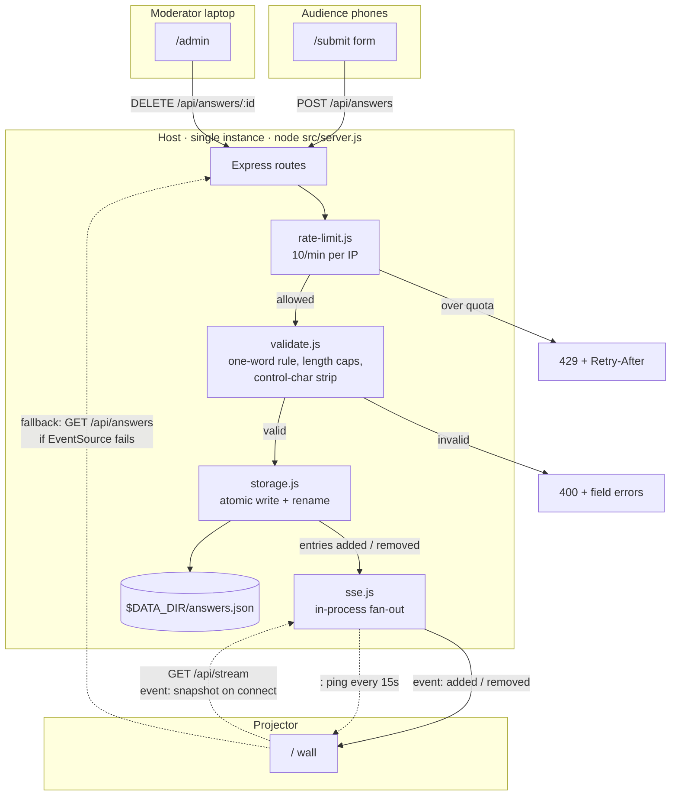

# Sovereignty Wall — operations guide

How to deploy, run and moderate the wall. Everything below uses
`https://your-wall.example.com` as a stand-in for wherever you deploy it.

## Deploying

The app is plain Node 22 with no build step, so any host that can run
`node src/server.js` will do (a small VM, a container, or a PaaS such as Azure
App Service, Render or Fly.io). Whatever you pick:

| Requirement | Why |
| --- | --- |
| **Exactly one instance** | SSE fan-out is in-process — see "Single instance is load-bearing". |
| **Start command `node src/server.js`** | Stops a platform process manager forking it into cluster mode. |
| **`ADMIN_KEY` set as a secret** | Enables moderation. Never commit it; rotate it per session. |
| **`DATA_DIR` on persistent storage** | `answers.json` lives there and should survive restarts. |
| **HTTPS enforced, `X-Forwarded-Proto` forwarded** | The QR is built from the incoming request, so it must see the real scheme. |

Set the admin key to a long random value, for example:

```bash
ADMIN_KEY="$(openssl rand -base64 24)"
```

Store it in your platform's secret store or environment settings — not in the
repo, not in a script, not in a shared document. On some platforms new settings
only reach the process after a restart; if `/admin` still returns 404 after
setting the key, restart the app and check again.

---

## Run sheet for the session

1. **Before the room fills** — open the wall on the projector:
   `https://your-wall.example.com/`
   Check the top-right indicator says **Live** (green). That means SSE is connected.
2. **To get people submitting** — switch the projector to
   `https://your-wall.example.com/qr` for a full-screen QR.
   Leave it up for a minute, then switch back to the wall.
3. **Latecomers** are covered: the wall keeps a QR and the short URL in the
   bottom-right corner permanently.
4. **If something inappropriate appears** — open the admin URL on your laptop or
   phone (keep that tab open *before* you start) and hit Delete. It disappears
   from the projector within a second, no refresh needed.
5. **Clearing the wall** — one command wipes every answer:
   ```bash
   node scripts/clear.mjs https://your-wall.example.com "$ADMIN_KEY"
   ```
   Connected projectors update live, no refresh. Note that restarting the app
   does *not* clear it — data persists in `DATA_DIR` by design.

### Pre-flight check (30 seconds)

```bash
node scripts/verify.mjs https://your-wall.example.com "$ADMIN_KEY"
```

This creates a test answer, proves it arrives over the live SSE stream, then
deletes it again. It should print `20/20 checks passed`.

Run `clear.mjs` immediately afterwards — the URL is already discoverable and
early arrivals do submit before the session starts.

---

## What was built

Three audience-facing surfaces plus a moderation escape hatch, on Node 22 +
Express 5 with **no build step** and **two pure-JS dependencies** (`express`,
`qrcode`).

| Route | Purpose |
| --- | --- |
| `GET /` | The projector wall. Two labelled zones, scattered answers, live. |
| `GET /submit` | The audience form. Two fields, thank-you state, "submit another". |
| `GET /qr` | Full-screen scannable QR pointing at `/submit`. |
| `GET /qr.svg` | The QR itself, as SVG, generated from the incoming request host. |
| `GET /admin?key=…` | Moderation list with per-answer delete. |
| `GET /api/answers` | JSON snapshot. |
| `POST /api/answers` | Submit. JSON or form-encoded. |
| `DELETE /api/answers/:id` | Moderation delete. Requires the admin key. |
| `GET /api/stream` | The SSE stream. |
| `GET /healthz` | `{ok, answers, streams}`. |

### Request and SSE flow



The wall subscribes to `/api/stream`. On connect the server immediately sends a
`snapshot` event, which removes the race between "fetch the current answers" and
"subscribe to new ones" — there is only one code path, and it cannot miss an
answer that lands mid-handshake.

---

## Decisions worth knowing

### Data is stored per answer, not per submission

One submission produces one or two entries (`{id, question, text, createdAt,
submissionId}`). This means a moderator can delete a single offending word
without destroying the person's perfectly good answer to the other question, and
each wall zone gets a flat list to render.

### Question 1 rejects, question 2 truncates

The brief capped q1 at ~30 chars and q2 at ~120, but didn't say what to do on
overflow. These are different situations:

- **q1 (one word) over 30 chars → rejected.** Truncating a single word puts a
  mangled fragment on a projector. Better to let the person fix it.
- **q2 (a phrase) over 120 chars → truncated** to 120 code points with an ellipsis.
  Rejecting a long sentence is annoying; trimming it is understood.

Lengths are counted in **code points**, not UTF-16 units, so slicing can't split
an emoji in half.

### The invisible-character strip deliberately spares `\t \n \r`

Stripping a newline would turn `"one\ntwo"` into `"onetwo"` and sneak two words
past the one-word rule. Whitespace is collapsed to a single space *first*, and
only then are zero-width and bidi-override characters removed. There is a test
pinning this.

### Rate limiting uses the *right-most* X-Forwarded-For entry

`req.ip` with `trust proxy: true` returns the **left-most** XFF entry, which the
client supplies and can therefore forge — trivially bypassing a per-IP limit. Each
proxy *appends* to XFF, so the right-most entry is the one your own front end
wrote. `src/lib/request.js#clientIp` takes that. Please don't "simplify" it back
to `req.ip`.

`trust proxy` is still enabled, but only so `req.protocol` honours
`X-Forwarded-Proto` when building the QR URL.

### Storage drops the oldest answer rather than refusing new ones

When the cap is reached, the oldest entries are evicted FIFO and their ids are
broadcast as `removed` so every connected wall stays in sync. Telling an audience
member "the wall is full" is a worse failure than quietly ageing out an old word.
The rate limiter is the real abuse guard.

A corrupt JSON file is quarantined to `answers.json.corrupt-<timestamp>` and the
app boots empty rather than crashing. A live session must not be bricked by a bad
file.

### No inline scripts or styles, anywhere

The CSP is `default-src 'self'` with no `unsafe-inline`. That's why every stylesheet
and script is an external file, and why the admin page passes its key via a
`data-admin-key` attribute rather than an inline script. All user text reaches the
DOM through `textContent`, never `innerHTML`.

### Single instance is load-bearing

SSE fan-out is in-process. If the host ran two workers, half the room would miss
half the answers. So, wherever you deploy:

- Pin instance count to **1**.
- Disable any per-instance worker forking (cluster mode).
- Set the start command explicitly to `node src/server.js`.

**Do not scale this out.** If you ever need to, the SSE hub has to move to a
shared pub/sub backend (Redis or similar) first.

---

## Verification

```bash
npm test                                         # node --test, no extra framework
node scripts/verify.mjs http://localhost:3000 "$ADMIN_KEY"
```

The unit and integration suites cover the validation rules, the storage
round-trip including atomic-write and corrupt-file recovery, the rate limiter,
HTML escaping, the template renderer, client-IP resolution, and a full HTTP
suite against a real server. `verify.mjs` then exercises a deployed instance:
pages, assets, the QR SVG, a live submission arriving over SSE, and admin
deletion. It prints `20/20 checks passed`.

Beyond the automated checks, the UI has been verified for layout (30 answers on
screen with no overlap, nothing escaping its zone, no page scroll) and contrast
(every answer colour ≥ 10.2:1 against the background, headings 17.7:1 — WCAG AA
needs 4.5:1, AAA needs 7:1).

---

## Known limitations

1. **Reject-vs-truncate** on the length caps is a judgement call (see above).
   Easy to flip in `src/lib/validate.js` if you disagree.
2. **Rotating `ADMIN_KEY` may need a restart.** Admin fails closed with a 404
   when no key is configured, so re-check `/admin` after rotating.
3. **Not load-tested.** Expected load is a room of people, which is nothing, but
   the SSE client cap and rate limit have only been exercised by tests, not by
   hundreds of real phones.
4. **Moderate before you project.** Nothing filters submissions for content —
   `/admin` is the escape hatch, so keep it open during a session.
5. **Tested on Node 22 and 24.** Node 22 is the minimum (`package.json#engines`).

---

## Project layout

```
src/
  config.js          questions, env config, data-dir resolution
  app.js             Express app factory: all routes, CSP, admin gate
  server.js          bootstrap + graceful shutdown
  lib/
    validate.js      the answer rules
    storage.js       atomic JSON persistence
    sse.js           SSE hub, heartbeat, client cap
    rate-limit.js    per-IP sliding window
    request.js       client IP + public origin resolution
    escape.js        HTML escaping
    template.js      tiny {{TOKEN}} renderer, escapes by default
views/               wall, submit, qr, admin
public/css|js/       plain CSS and vanilla ES modules
test/                node --test suites (100 tests)
scripts/verify.mjs   end-to-end checker for any running instance
scripts/clear.mjs    wipes every answer via the admin API
```
